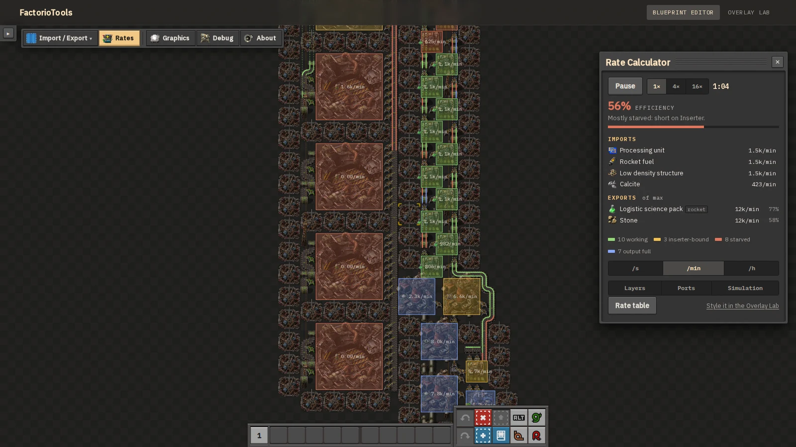
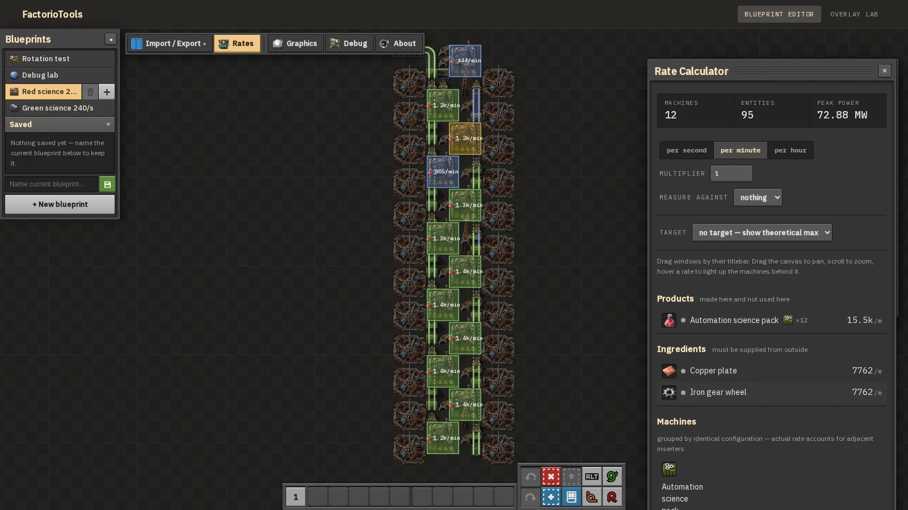
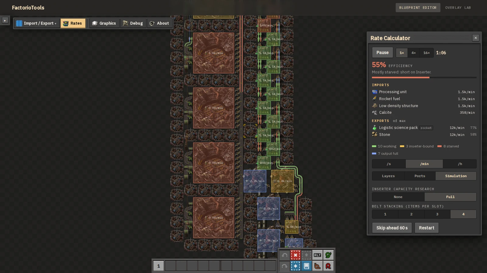
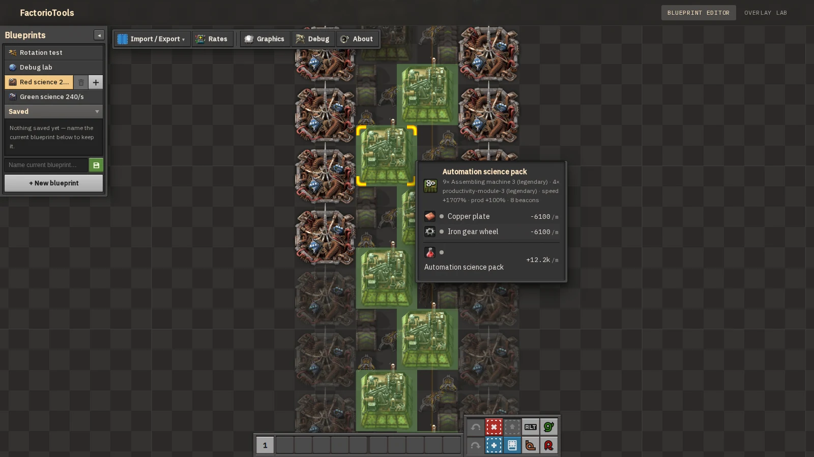
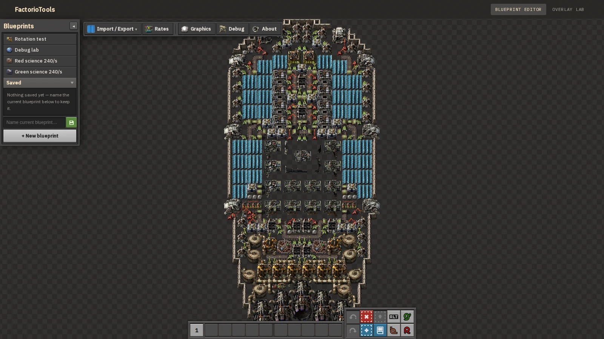
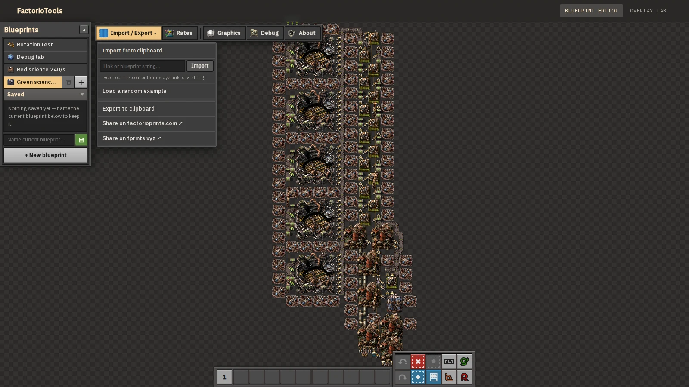
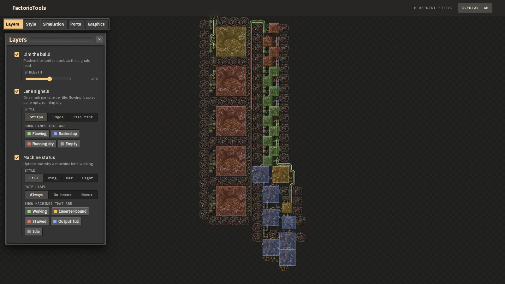
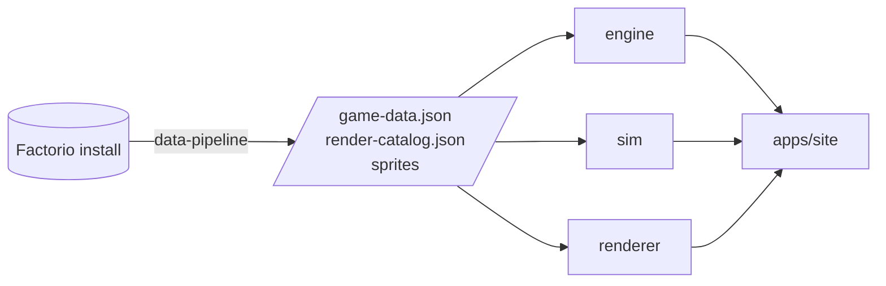

<div align="center">

# FactorioTools

**Paste a blueprint. Find the bottleneck. Fix it. Export.**

A browser-based Factorio blueprint editor built for optimising production lines —
with a rate calculator, a tick-by-tick belt simulation and the game's own art.

[](https://malte9799.github.io/FactorioTools)

[](https://github.com/malte9799/FactorioTools/actions/workflows/ci.yml)


[](LICENSE)

[Features](#-features) · [Quick start](#-quick-start) · [Build from source](#-build-from-source) · [Architecture](#-architecture) · [Licence](#-licence)

<br>



</div>

<br>

> [!NOTE]
> **Everything runs client-side.** No server, no upload, no account — blueprint
> strings never leave the page.

## ✨ Features

<table>
  <tr>
    <td width="50%" valign="top">
      <h3>📊 Calculates rates</h3>
      Items per second across the whole blueprint, grouped by machine
      configuration — with module and beacon effects, quality tiers and
      productivity research all accounted for. Imports, exports and the
      share of theoretical max at a glance.
    </td>
    <td width="50%">
      
    </td>
  </tr>
  <tr>
    <td width="50%">
      
    </td>
    <td width="50%" valign="top">
      <h3>⏱️ Simulates belts tick by tick</h3>
      Per-lane transport lines, curves, side-loading, undergrounds and
      splitters — so lane imbalance and starved inputs show up the way they
      would in game. Run at 1×, 4× or 16×, skip ahead a minute, and toggle
      inserter capacity research and belt stacking.
      <br><br>
      <b>Circuits run too:</b> constant, arithmetic, decider and selector
      combinators on separate red and green networks — Each, Anything and
      Everything included — switch belts, inserters and machines on and off,
      read their contents, and light lamps and display panels.
    </td>
  </tr>
  <tr>
    <td width="50%" valign="top">
      <h3>🔍 Analyses on the map</h3>
      Lane signals, machine uptime, and a ranked list of what costs output,
      each traced from the symptom back to its cause. Hover any machine for
      its recipe, modules, beacons and exact per-minute flows.
    </td>
    <td width="50%">
      
    </td>
  </tr>
  <tr>
    <td width="50%">
      
    </td>
    <td width="50%" valign="top">
      <h3>🎨 Renders with the game's own art</h3>
      Belts animate, poles turn to face their wires, pipes and walls pick
      their connection art from their neighbours, and machines show their
      recipe and modules in alt-mode. Space Age, quality and elevated rails
      included.
    </td>
  </tr>
  <tr>
    <td width="50%" valign="top">
      <h3>🛠️ Edits in place</h3>
      Place, rotate and erase; configure recipes and modules; wire poles and
      combinators; undo and redo. Import from a string, a
      <a href="https://factorioprints.com">factorioprints.com</a> or
      <a href="https://fprints.xyz">fprints.xyz</a> link, then export the
      result back to a blueprint string.
    </td>
    <td width="50%">
      
    </td>
  </tr>
  <tr>
    <td width="50%">
      
    </td>
    <td width="50%" valign="top">
      <h3>🧪 Overlay Lab</h3>
      Tune how the analysis is drawn: dim the build, choose lane-signal and
      machine-status styles, and filter to just the lanes or machines you
      care about — flowing, backed up, starved, output full, idle.
    </td>
  </tr>
</table>

## 🚀 Quick start

1. Open **[malte9799.github.io/FactorioTools](https://malte9799.github.io/FactorioTools)**.
2. In game, copy a blueprint to the clipboard.
3. Click **Import / Export → Import from clipboard** and paste the string or link.
   No blueprint handy? **Load a random example** picks from 170+ curated builds.
4. Open **Rates** to see what it produces, where it loses output, and why.

## 🧰 Build from source

### Requirements

- **Node.js 22+**
- **Factorio 2.0** — only if you want to regenerate the sprites and game data
  (Space Age, quality and elevated rails are read if present)

The generated dataset in `apps/site/public/data/` is checked in, so cloning
and running is enough to work on the app:

```bash
git clone https://github.com/malte9799/FactorioTools.git
cd FactorioTools
npm install
npm run dev
```

### Commands

| Command | What it does |
|---|---|
| `npm run dev` | Start the dev server |
| `npm run build` | Production build into `apps/site/dist` |
| `npm test` | Engine, simulation and renderer test suites |
| `npm run check` | Typecheck every workspace |

### Regenerating the game data

<details>
<summary><b>Rebuild sprites and prototypes from your own Factorio install</b></summary>

<br>

First, dump the prototype data from inside the game. This writes
`data-raw-dump.json` into Factorio's `script-output` directory:

```bash
factorio --dump-data
```

Then run the pipeline **in this order** — the steps are not independent:

```bash
npm run dump-to-gamedata   --workspace=@factoriotools/data-pipeline
npm run extract-sprites    --workspace=@factoriotools/data-pipeline
npm run crop-sprite-sheets --workspace=@factoriotools/data-pipeline
```

| Step | Output |
|---|---|
| `dump-to-gamedata` | Reads the dump and writes `game-data.json` and `render-catalog.json`. |
| `extract-sprites` | Copies the referenced sheets out of the install, plus the shortcut-bar art the quickbar draws its buttons from. |
| `crop-sprite-sheets` | Trims each sheet to the cells the renderer actually samples (143 MB → 10.6 MB) and rewrites the catalog's column counts to match. |

> [!WARNING]
> Running the first step alone leaves the catalog claiming uncropped column
> counts against cropped images, which silently breaks about 29 entities.
> If you regenerate, regenerate all three.

**Good to know**

- Non-standard install paths are read from `FACTORIO_DATA` and `FACTORIO_DUMP`.
- `extract-sprites` is incremental: it stamps each source file's size and
  mtime and skips anything unchanged whose output is still present, so
  re-running it after a crop leaves the cropped sheets alone. Pass `--force`
  to rebuild regardless.
- Until the shortcut art exists, the quickbar shows plain text labels.
- The belt simulation reads belt speeds, underground lengths and splitter
  prototypes from `game-data.json`. A dataset generated before those were
  extracted still works — `packages/sim` falls back to built-in vanilla values.

</details>

## 🏗️ Architecture

An npm-workspaces monorepo. `engine`, `sim` and most of `renderer` are
DOM-free and tested directly with `tsx`; `apps/site` is the browser layer.



| Workspace | What it holds |
|---|---|
| [`packages/engine`](packages/engine) | Blueprint decode/encode, the rate calculator, prototype types. No DOM. |
| [`packages/sim`](packages/sim) | Tick-by-tick belt simulation: per-lane transport lines, curves, side-loading, undergrounds, splitters; and the circuit network. No DOM. |
| [`packages/renderer`](packages/renderer) | Canvas renderer: sprite atlas, neighbour classification, camera, draw passes. |
| [`packages/data-pipeline`](packages/data-pipeline) | One-time scripts that turn a Factorio install into the dataset. |
| [`apps/site`](apps/site) | The page itself — panels, menus, editing, library. |

Every pushed branch is built and published as a preview under
`https://malte9799.github.io/FactorioTools/preview/<branch>/`.

### Code audit

[`audit/`](audit) holds a full code audit — 19 findings with severity and
effort ratings, the implementation reports, and the verification scripts that
back them. The scripts are runnable and self-checking; one of them,
`verify-render-identical.ts`, hashes the entire render path so a refactor can
prove it changed no pixels.

## 📜 Licence

The code is [MIT](LICENSE). Blueprint math is ported from
[Rate Calculator](https://codeberg.org/raiguard/RateCalculator) by raiguard,
also MIT licensed.

Factorio, its prototype data and its sprite art are the property of
[Wube Software](https://factorio.com) and are **not** covered by that licence.
This project reads them from a Factorio installation at build time and is not
affiliated with Wube Software.
